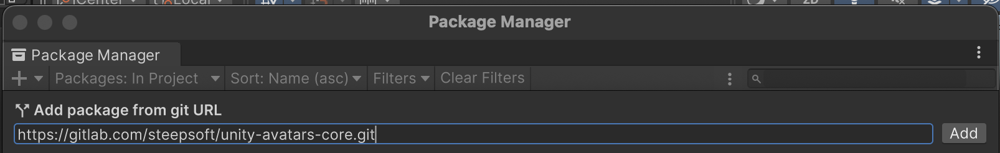

# Avatars Loader Core

## About

This is a Unity package named "Avatars Loader Core" (`multiversx.avatar.core`). This package is responsible for installing all necessary dependencies and the "Avatars Loader" (`multiversx.avatar.loader`) package.

## Installation

This package can be installed via Unity's Package Manager:

1. Open your Unity project.
2. Navigate to `Window` > `Package Manager`.
3. Click the `+` button and select `Add package from git URL`.
4. Enter the following URL: `https://github.com/multiversx/mx-unity-avatar-core.git`
5. Click `Add`.

This will automatically install all the required dependencies and the Avatars Loader package for your Unity project.

After the installation is complete, the 'Multiversx' toolbar option is ready to use.

## Usage

After installing this package, it will automatically handle the dependencies and installations required for your Unity project.

For the avatar import detailed steps, please visit `https://github.com/multiversx/mx-unity-avatar-loader` readme.

## Version

The current version of the package is 1.0.0
